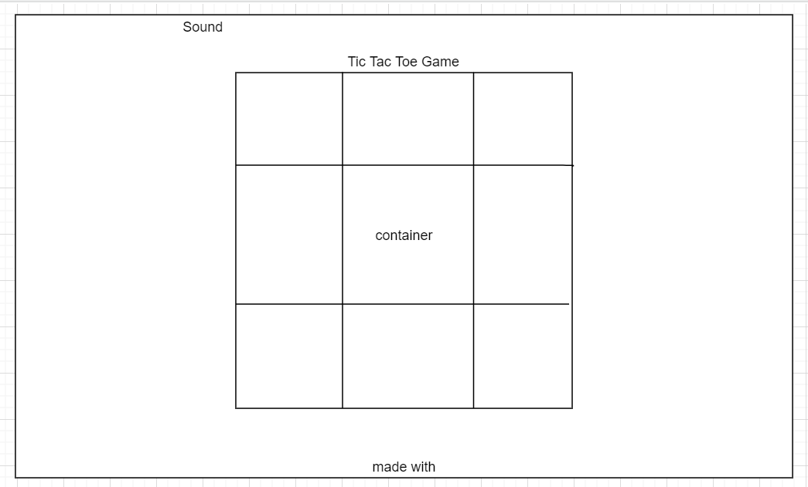
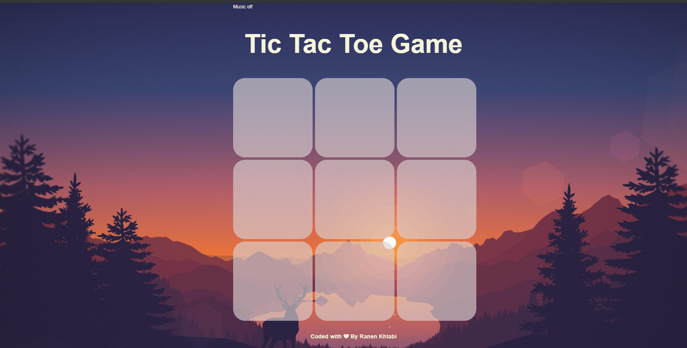
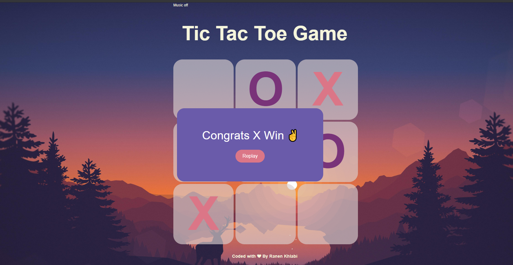
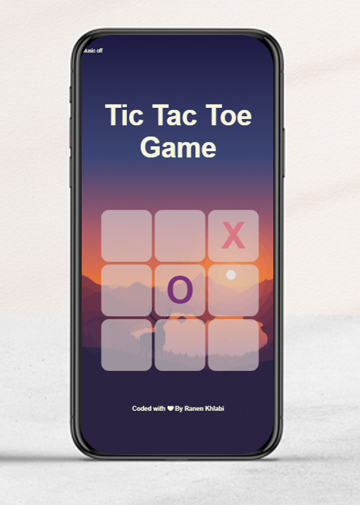

# TicTacToe Game
 

##### Let's play: https://ranen-khlabi.github.io/TicTacToe/
​
## Technologies
* HTML
* CSS
* JavaScript

## Wireframe

## Mockup

## User Story
1. The player can turn on/off for music.
2. The player can click to any box to add X or O.
3. The player can play on any device because it's responsive.

## version 2
- Make localStorage.
- Add User Sign In, and Sign Out.